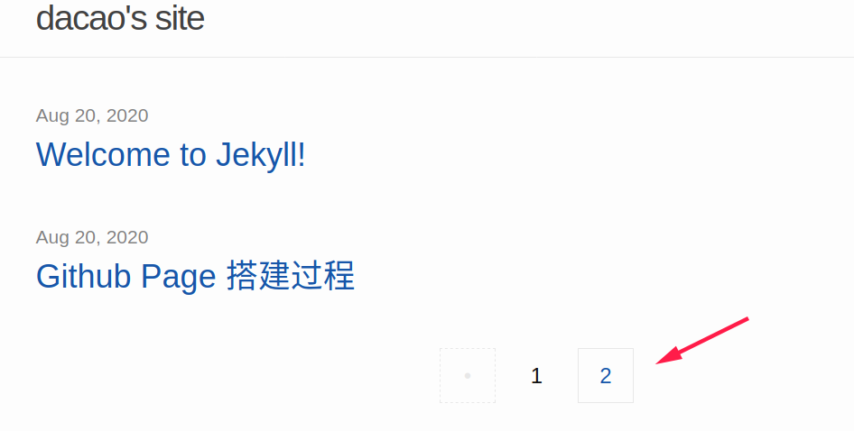
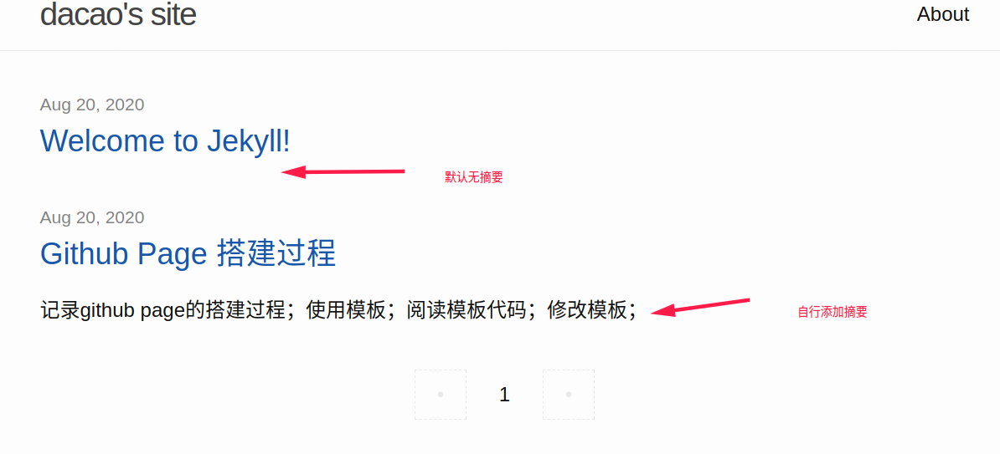
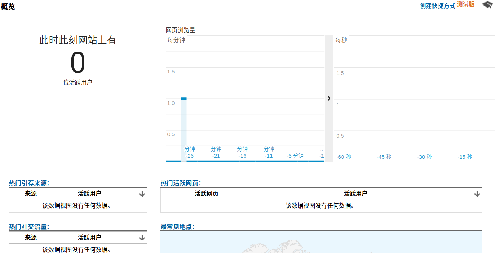
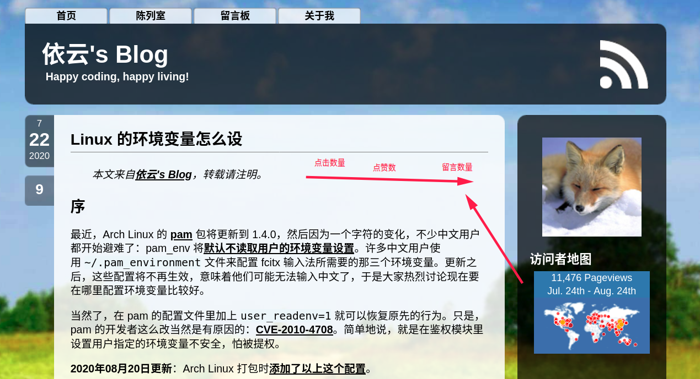
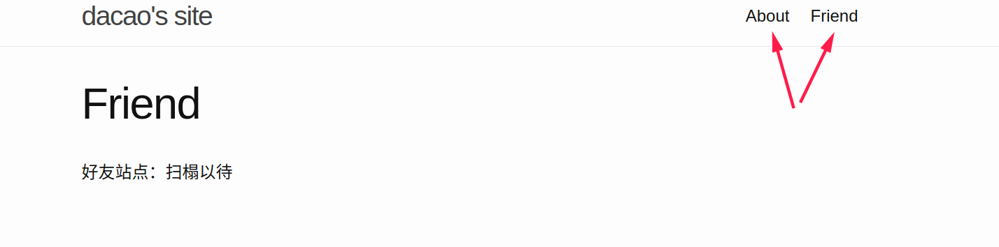
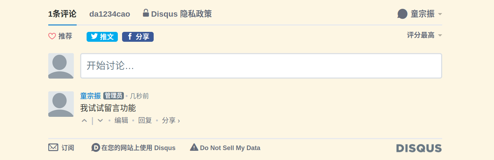
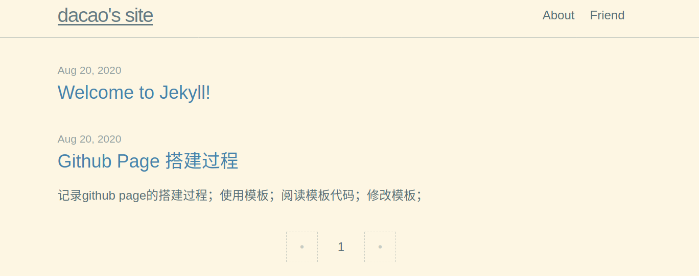
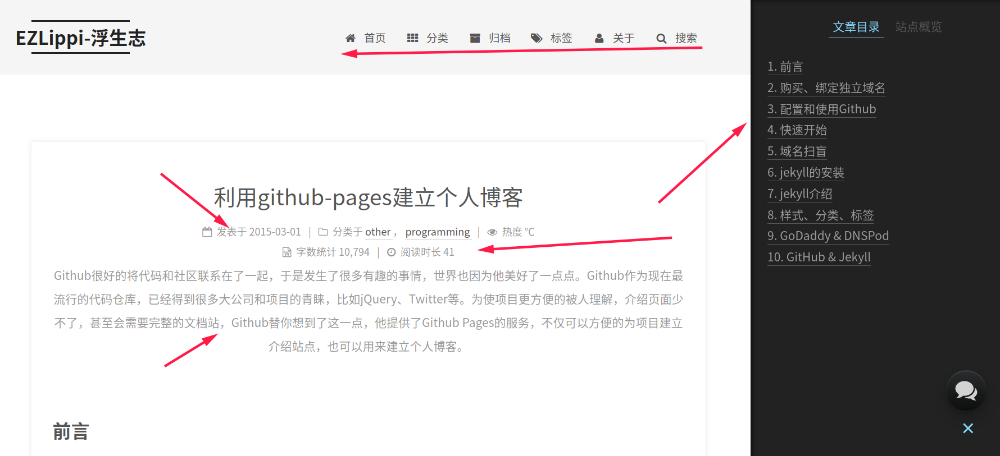
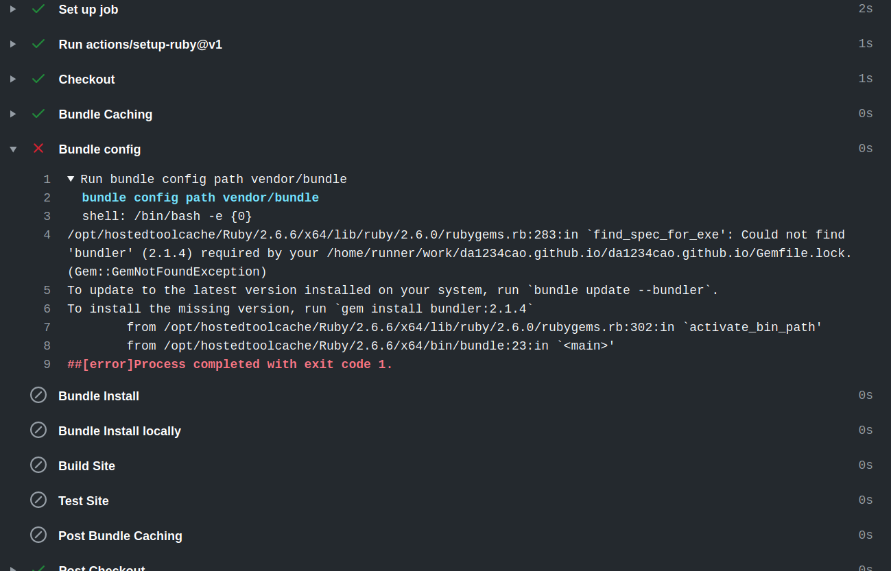

## 0. 前言

目的：使用github page搭建一个个人博客站点。

思路：

* 简单能用；
* 阅读默认模板的代码，理解构建过程;
* 挑选喜欢的模板，阅读其代码构建，小修小改;
* 使用的过程中迭代更新。

<br>

## 1. 简单能用

首先网上随意找一篇，上手操作：[GitHub Pages 搭建教程  --- 少数派](https://sspai.com/post/54608)

### 1.1 修改

**修改使用默认minima主题**。

默认主题有两个index文件。github page在线时，head层有两个，删除一个。

### 1.2 无法显示图片

我设置了文章的永久链接：`hostname/jekyll/:categories/:title`

```yml
defaults:
  -
    scope:
      path: "_posts"
      type: "posts"
    values:
      author: "dacao"
      permalink: "/:categories/:title"
```

在浏览器中，用f12查看源码，很容易发现，**图片的路径不对**。

* 使用typora，我的图片放在目录`_posts/小知识/2020-7-14-github-page的打造过程.assets`文件夹中。
* 文章编译之后，位置在`_site/jekyll/小知识/github-page的打造过程.html`
* 使用浏览器访问，`http://127.0.0.1:4000/jekyll/小知识/github-page的打造过程`
  * 网页源码中，图片位置是`2020-7-14-github-page的打造过程.assets/image-20200704094853730.png`
  * **编译之后的分类目录下，没有图片文件夹**。

我们从网上，找看下他们对图片是如何处理的：[sinantang.github.io](https://sinantang.github.io/)

(顺便说下，上面链接的page功能上来说，还不错，有分类、标签、时间轴，搜索、留言，挺好。)

**把图片放在一个根目录开始的文件夹中** （或者搞一个图床也行）。

Tips: 

* 对于根目录而言：`../`和`./`作用相同，都表示当前目录；
* 使用绝对路径也可以，但是在本地不方便查看；
* 不如两份，本地的用相对路径；上传之前复制修改一份为绝对路径；

### 1.3 改进思路

至此，这个博客基本可以使用了。

但是我还希望拥有一些功能：分类、标签、时间轴，搜索、留言，访问量，统计等

在找模板在前，我先看下minima的源码是如何构建的。

<br>

## 2. 查看默认主题minima的源码

minima的README： [jekyll/minima --- github](https://github.com/jekyll/minima)

文字资料：[GitHub Pages  --- github官方文档](https://docs.github.com/cn/github/working-with-github-pages/getting-started-with-github-pages) 、 [jekyll --- 官网文档](http://jekyllcn.com/docs/home/)

视频：[Jekyll - 静态网站生成器教程双语字幕](https://www.bilibili.com/video/BV1qs41157ZZ)

思路：**顺着前端显示与运行的代码进行对比，查看代码的重点功能，最后统一于minima的README**。

### 2.1 分页

```shell
# index 使用 home布局

# home 使用default布局
首先是标题
接着是index.html中的内容
site.paginate ---是否分页
  
    
  
    
  

# _config.yml
paginate: 2
paginate_path: "blog/page:num"
```

[分页功能](https://jekyllcn.com/docs/pagination/) 提示：设置 permalink 会造成分页功能的瘫痪。缺省设置 permalink 即可。

我尝试了下，本地分页和永久链接可以并存，不冲突。

**先[安装](http://jekyllcn.com/docs/plugins/)paginate插件，配置_config.yml以启用插件，home.html根据配置决定是否启用分页**。

> 分页原理：`blog/index.html` 将会读取这个设置，把它传给每个分页页面，然后从第 `2` 页开始输出到 `blog/page:num`, `:num` 是页码。如果有 12 篇文章并且做如下配置 `paginate: 5`, Jekyll 会将前 5 篇文章写入 `blog/index.html`，把接下来的 5 篇文章写入 `blog/page2/index.html`，最后 2 篇写入 `blog/page3/index.html`。



### 2.2 文章摘要

```shell
# 分页代码中还包含这一行，表示是否添加摘要

    {{ post.excerpt }}


# _config.yml
# 启用摘要
show_excerpts: true
# 默认没有摘要,自动提取第一段太丑了。
excerpt_separator: ""

# 手动添加摘要
---
excerpt_separator: <!--more-->
---
```

[摘要](https://jekyllcn.com/docs/posts/#%E6%96%87%E7%AB%A0%E6%91%98%E8%A6%81) 默认会自动提取第一段，非常不好看；采用自行生成摘要；如果忘记写文章的摘要，默认无。



### 2.3 google分析

```shell
  
    
  

# _config.yml
google_analytics: UA-176123663-1
```



但是**我希望有下面的统计。暂时不知道怎么弄**。



### 2.4 导航链接

```html
# header.html
    
    
    

    
      
      
       <a class="page-link" href="{{ my_page.url | relative_url }}">{{ my_page.title | escape }}</a>
        
    

#  _config.yml
# 自定义导航链接
header_pages:
  - navigation_links/about.md
  - navigation_links/friend.md
```

在这个基础上，如何改造一个分类博客。

通过导航链接，转到一个页面，页面可以提取到文章内容。

但是现在我只会提取整个post，不会按照博客内别提取。

可以按照`categories`内容，提取。我目前不操这个心。我目前可以看个大概，不会写。



### 2.6 订阅

[jekyll-feed](https://link.zhihu.com/?target=https%3A//github.com/jekyll/jekyll-feed) 

```shell
# jekyll-feed插件
gem "jekyll-feed"
```

```html
        <p class="feed-subscribe">
          <a href="{{ 'feed.xml' | relative_url }}">
            <svg class="svg-icon orange">
              <use xlink:href="{{ 'assets/minima-social-icons.svg#rss' | relative_url }}"></use>
            </svg><span>Subscribe</span>
          </a>
        </p>
```


### 2.7 图标

```shell
#  _config.yml
# 图标
minima:
  social_links:
    github: da1234cao
author:
  name: da1234cao
  email: "17355051286@163.com"
```

```html
    <div class="social-links">
      
    </div>
```

问题在于，`social.html` 没有的社交账号如何添加。


### 2.8 评论区

```shell
#  _config.yml
  disqus:
    shortname: my_disqus_shortname
```

> Yes. To manage comments in Disqus you will need to [register your site](http://disqus.com/admin/create) and [install Disqus on your site](http://disqus.com/admin/install) using the shortname registered.




### 2.9 皮肤选择

选一个温馨点的皮肤；

```shell
"minima/skins/{{ site.minima.skin | default: 'classic' }}",

#  _config.yml
minima:
  skin: solarized
```




### 2.10 目录

文章一定要有目录的。

如果是本地md查看，一般放在顶部，使用toc；

在线查看，使用使用一个侧边栏显示，那时很好看的。

下面这样的模板，就很合我的意，待会来找个这样的。




## 3. 中意的模板

上面好看的模板，使用的是hexo，不是jekyll，我得找寻找寻。

网上有很多好看的，我先去官网瞅瞅：[jekyllthemes](http://jekyllthemes.org/)

最后选择了：[jekyll-theme-chirpy](http://jekyllthemes.org/themes/jekyll-theme-chirpy/) ，比较中规中矩，不是特别fasion，还不错。

没关系，这就像养孩子一样，养坏了，再养一个就好。大宝不听话，就再来个二宝。

腻歪了，哪天再换换模板。

### 3.1 保留minima主题

原来的主题保留下，用分支保存，是个挺不错的入门导读。

```shell
# 从 master 分支上创建 minima 分支: 
git checkout –b minima master
# 推送 develop 分支:
git push origin minima
```

### 3.2 不喜欢的地方

导航栏喜欢在顶部，不喜欢在侧面；

### 3.3 报错

